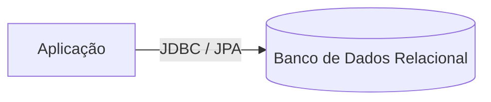

# Brasil Travel — Sistema de Reserva de Voos

> Aplicação para gerenciamento de voos, passageiros e reservas, desenvolvida para a disciplina de Banco de Dados II.


## Sobre o projeto

O **Brasil Travel** é uma aplicação de banco de dados relacional voltada à gestão de voos nacionais, desenvolvida como Fase 1 do projeto da disciplina de Banco de Dados II.

O sistema permite consultar voos disponíveis, gerenciar passageiros e companhias aéreas, e registrar reservas, associando passageiro e voo, além de armazenar informações próprias de cada reserva, como assento e status.

A modelagem completa (esquema conceitual e dicionário de dados) está disponível no documento em [`/docs`](https://docs.google.com/document/d/1ZimgIUvIiVJFccTN62y9IjEm_NN7Z66J/edit).



## Funcionalidades

| Categoria | Operações |
| --- | --- |
| Voos | Cadastro, consulta, atualização e remoção |
| Passageiros | Cadastro, consulta, atualização e remoção |
| Companhias aéreas | Cadastro, consulta, atualização e remoção |
| Reservas (associativa) | Efetuar reserva, atualizar status, cancelar |

## Tecnologias

| Camada | Tecnologia |
| --- | --- |
| Linguagem | Java 17 |
| Framework | Spring Boot (Web, Data JPA) |
| Banco de dados | MySQL (relacional) |
| Gerenciador de dependências | Maven |
| Hospedagem | Railway |

## Estrutura do projeto

A estrutura final está sendo definida pela equipe durante o desenvolvimento. Em linhas gerais:

```text
.
├── backend/     # Aplicação Spring Boot
├── database/    # Backup do banco de dados (.sql)
├── docs/        # Documento de modelagem (esquema conceitual e dicionário de dados)
└── README.md
```

Esta seção será atualizada assim que a estrutura de pastas do backend estiver definida.

## Como executar

### Pré-requisitos

- [Java 17+](https://adoptium.net/)
- [Maven](https://maven.apache.org/)
- MySQL (local ou instância no Railway)

### Passo a passo

1. Clone o repositório:
   ```bash
   git clone https://github.com/usuario/brasil-travel.git
   cd brasil-travel
   ```

2. Crie o banco de dados local e restaure o backup:
   ```bash
   mysql -u seu_usuario -p -e "CREATE DATABASE brasil_travel;"
   mysql -u seu_usuario -p brasil_travel < database/backup.sql
   ```

3. Configure a conexão em `application.properties` (ou variáveis de ambiente equivalentes):
   ```properties
   spring.datasource.url=jdbc:mysql://localhost:3306/brasil_travel
   spring.datasource.username=seu_usuario
   spring.datasource.password=sua_senha
   ```

4. Execute a aplicação:
   ```bash
   ./mvnw spring-boot:run
   ```

5. Acesse conforme a interface implementada (modo texto ou `http://localhost:8080`, dependendo da definição final da equipe).

> Este passo a passo será revisado assim que a estrutura definitiva do backend estiver pronta.

## Deploy (Railway)

| Variável | Valor |
| --- | --- |
| `DB_URL` | `jdbc:mysql://<host-interno-railway>:3306/railway` |
| `DB_USERNAME` | fornecido pelo serviço de banco no Railway |
| `DB_PASSWORD` | fornecido pelo serviço de banco no Railway |
| `PORT` | `8080` |

Aplicação publicada: [https://brasil-travel.up.railway.app](https://brasil-travel.up.railway.app) *(atualizar com o link real)*

## Vídeo de demonstração

[https://youtu.be/codigo-do-video](https://youtu.be/codigo-do-video) *(atualizar com o link real)*

## Equipe

| Integrante |
| --- |
| Isadora Pimenta de Oliveira |
| Luís Felipe dos Anjos de Carvalho |

**Professora:** Rebeca Schroeder Freitas
**Disciplina:** Banco de Dados II
**Curso/Turma:** TADS 2026/02
